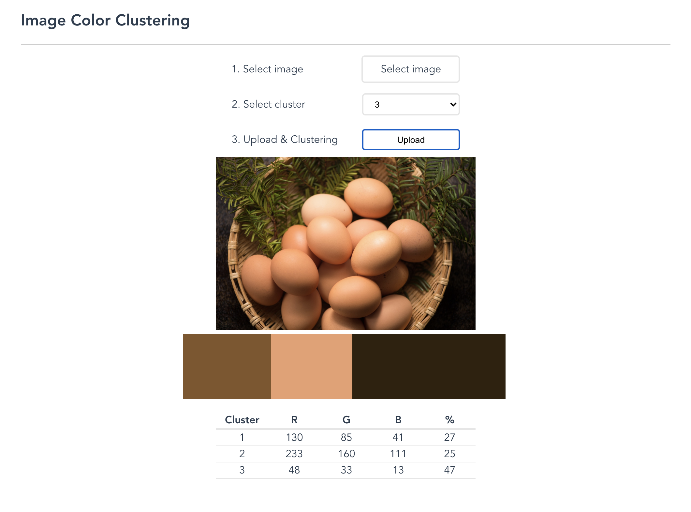

# Image Color Clustering

## Environment Requirement
* Python (version <=3)
* pipenv
* Node.js

## Install Python Libraries

```
. install.sh 
```

## Build Frontend

```
cd frontend/
npm run build
```

## Start Development

```
python3 main.py
```
or

```
pipenv run main 
```

Then visit http://127.0.0.1:5000/

## Screen Image

